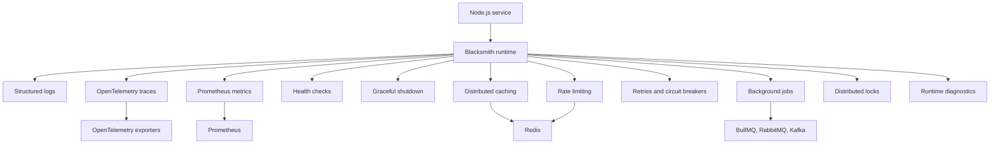
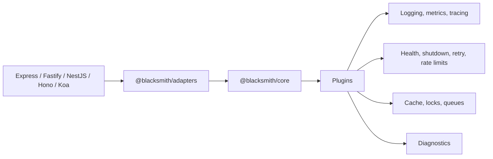
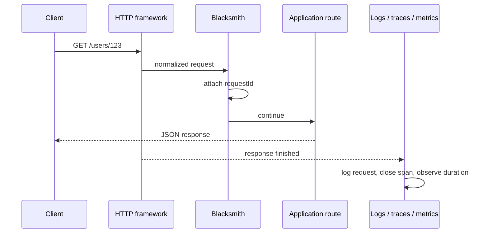
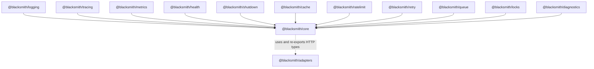

# Blacksmith

Blacksmith is a TypeScript-first production layer for Node.js services.

It is built for teams that already have an application framework and do not want another one. Keep Express, Fastify, NestJS, Hono, or Koa. Add Blacksmith when the service needs the operational pieces that always arrive sooner or later: logs, request IDs, metrics, traces, health checks, graceful shutdown, caching, rate limits, retries, jobs, locks, and diagnostics.

A full production setup will look like this once the planned packages are complete:

```ts
import express from "express";
import { forge } from "@blacksmith/core";
import { CachePlugin } from "@blacksmith/cache";
import { HealthPlugin } from "@blacksmith/health";
import { LoggingPlugin } from "@blacksmith/logging";
import { MetricsPlugin } from "@blacksmith/metrics";
import { QueuePlugin } from "@blacksmith/queue";
import { RateLimitPlugin } from "@blacksmith/ratelimit";
import { RetryPlugin } from "@blacksmith/retry";
import { ShutdownPlugin } from "@blacksmith/shutdown";
import { TracingPlugin } from "@blacksmith/tracing";

const app = express();

await forge(app, {
  serviceName: "billing-api",
  plugins: [
    new LoggingPlugin(),
    new TracingPlugin(),
    new MetricsPlugin(),
    new HealthPlugin({ checks }),
    new CachePlugin({ store: redisCache }),
    new RateLimitPlugin({ store: redisRateLimitStore }),
    new RetryPlugin(),
    new QueuePlugin({ backend: bullmq }),
    new ShutdownPlugin()
  ]
});

app.listen(3000);
```

The application remains yours. Blacksmith supplies the runtime wiring that every production service tends to grow around it.

## What It Provides



Blacksmith is designed around boring defaults. A small service can start with logging, metrics, health, tracing, and shutdown. As the system grows, the same runtime can add cache, rate limits, retries, queues, locks, and diagnostics without changing frameworks.

## Core Ideas

Blacksmith has three layers:

- `@blacksmith/core` creates the runtime, request context, event bus, plugin lifecycle, and registry.
- `@blacksmith/adapters` handles framework integration for Express, Fastify, NestJS, Hono, Koa, and similar servers.
- Feature plugins add operational behavior.



Every request receives a shared context:

```ts
req.blacksmith = {
  requestId: "req_abc123",
  startTime: process.hrtime.bigint()
};
```

That one context connects logs, spans, metrics, retries, cache events, and queued jobs.

## Request Flow



The framework still handles routing. Blacksmith watches the operational lifecycle around it.

## Finished Feature Set

### Observability

- Pino-based structured logs
- Request IDs and response headers
- OpenTelemetry server spans
- Prometheus metrics
- Runtime metrics such as memory, CPU, event loop lag, and uptime
- Shared request context across logs, metrics, and traces

### Health And Runtime Safety

- `/health`
- `/liveness`
- `/readiness`
- Dependency checks for databases, Redis, queues, and external services
- Graceful `SIGTERM` and `SIGINT` handling
- Shutdown hooks for HTTP servers, queues, clients, and workers

### Caching

- Memory and Redis cache stores
- `getOrSet` API
- Optional decorators for method-level caching
- TTLs, namespaces, invalidation, and cache analytics
- Cache hit/miss events for metrics and diagnostics

### Rate Limiting

- Memory and Redis-backed counters
- Global, route-level, and identity-based policies
- Standard rate limit headers
- Configurable fail-open or fail-closed behavior

### Retries And Circuit Breakers

- Exponential backoff
- Jitter
- Retry budgets
- Circuit breaker state tracking
- Events and metrics for attempts, failures, and open circuits

### Background Jobs

- Unified queue API
- BullMQ, RabbitMQ, and Kafka adapters
- Job context propagation
- Worker lifecycle hooks
- Queue health, metrics, and retry visibility

### Distributed Coordination

- Distributed locks for scheduled work and critical sections
- Ownership tokens
- TTL renewal
- Safe release semantics

### Diagnostics

- Registered plugin inventory
- Runtime configuration summary
- Health check state
- Queue and cache status
- Rate limit store status
- Operator-friendly diagnostics endpoint

## Package Map



Current packages in this repository:

- `@blacksmith/core`
- `@blacksmith/adapters`
- `@blacksmith/cache`
- `@blacksmith/logging`
- `@blacksmith/tracing`
- `@blacksmith/metrics`
- `@blacksmith/health`
- `@blacksmith/shutdown`

Planned packages:

- `@blacksmith/ratelimit`
- `@blacksmith/retry`
- `@blacksmith/queue`
- `@blacksmith/locks`
- `@blacksmith/diagnostics`

## Example

```bash
npm install
npm run build
npm run dev --workspace @blacksmith/example-express
```

Try the example service:

```bash
curl http://localhost:3000/users/123
curl http://localhost:3000/health
curl http://localhost:3000/readiness
curl http://localhost:3000/metrics
```

## Design Principles

- Blacksmith is not the application framework.
- Core stays small.
- Framework-specific behavior lives in adapters.
- Operational capabilities live in plugins.
- Plugins coordinate through events and registry values, not private imports.
- Defaults should make a service useful immediately.
- Production behavior should be explicit when tradeoffs matter.

## Documentation

For the deeper system design, see [docs/architecture.md](docs/architecture.md).
