# Architecture

Blacksmith is a production-readiness layer for Node.js services. It sits beside an application framework, not above it. The application keeps owning routing, controllers, request validation, business logic, database access, and deployment shape. Blacksmith owns the operational plumbing that most services eventually need: logs, request IDs, traces, metrics, health checks, shutdown, cache coordination, rate limits, retries, jobs, locks, and diagnostics.

The central rule is simple: the core should orchestrate, plugins should do the work, and adapters should isolate framework differences.

## System View

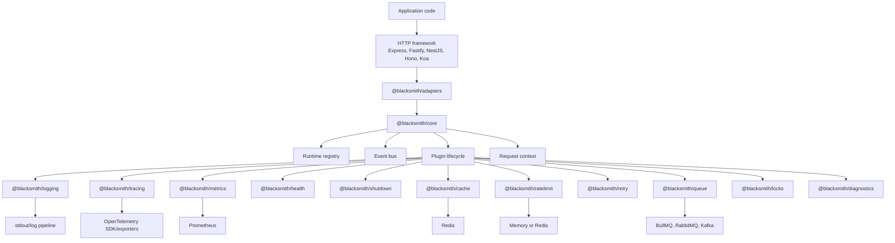

Blacksmith deliberately keeps infrastructure concerns visible. A plugin can register routes, middleware, event listeners, shutdown hooks, and shared dependencies, but it should not hide application behavior behind implicit magic.

## Package Boundaries

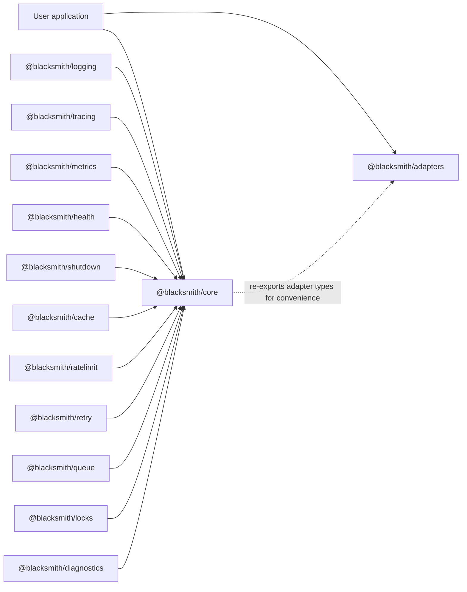

`@blacksmith/core` owns the runtime. It creates the event bus, registry, request context middleware, and plugin lifecycle. It does not know how Redis, Prometheus, BullMQ, or OpenTelemetry work.

`@blacksmith/adapters` owns framework integration. An adapter turns framework-specific APIs into the narrow Blacksmith HTTP surface: `use(middleware)` and `get(path, handler)`.

Feature packages own operational behavior. They depend on core, and sometimes on external libraries, but they should avoid depending on each other. Cross-plugin coordination should happen through the registry or event bus.

## Runtime Startup

`forge(app, options)` is the entrypoint. It detects or receives an HTTP adapter, creates the runtime, installs base request context middleware, registers plugins, starts plugins, and returns the runtime handle.

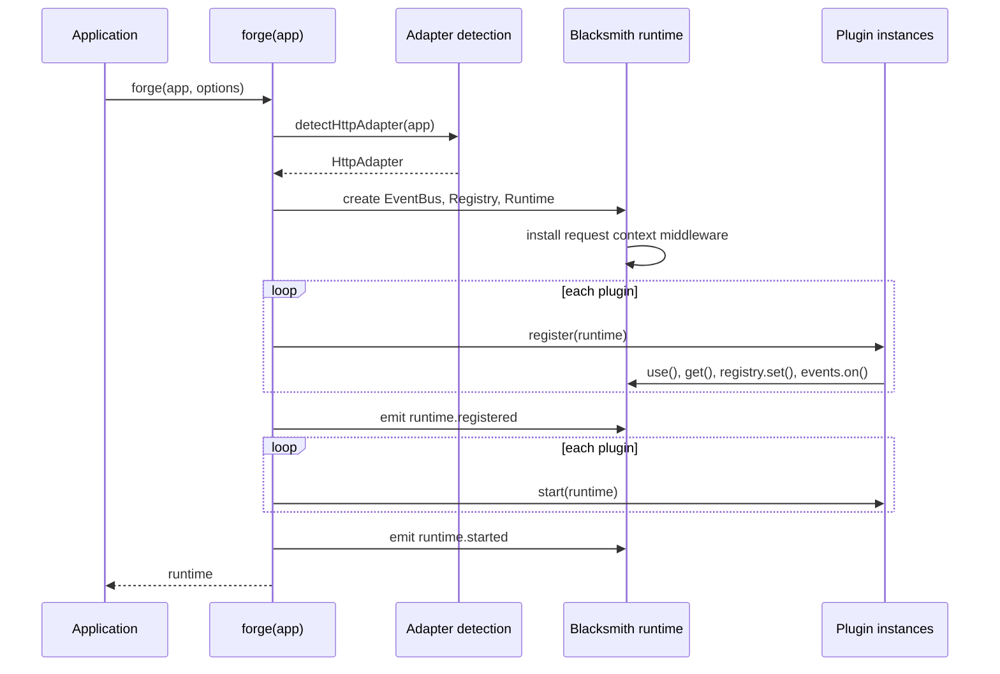

The runtime returned by `forge` is intentionally small:

```ts
runtime.use(middleware);
runtime.get("/path", handler);
runtime.events.emit("event.name", payload);
runtime.registry.set("key", value);
await runtime.stop();
```

That small surface is what keeps plugin authors honest. If a feature needs more than middleware, routes, events, registry values, and lifecycle hooks, it should justify the new runtime capability explicitly.

## Request Lifecycle

Every inbound request passes through the adapter, then through Blacksmith middleware, then into the application route. Plugins can observe the request before and after application code runs.

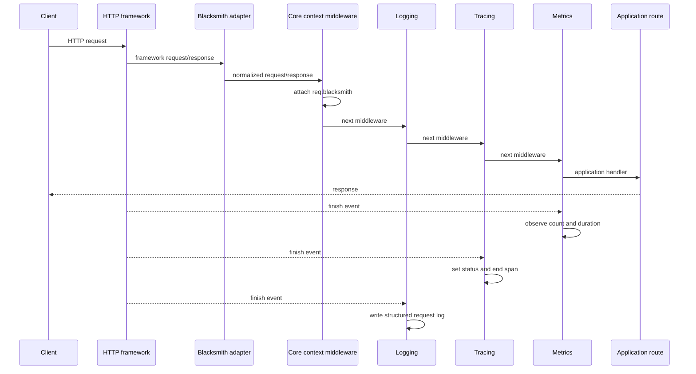

The shared request context is attached once:

```ts
{
  requestId: string;
  startTime: bigint;
  route?: string;
}
```

Plugins should prefer the shared context over generating their own request IDs. This keeps logs, metrics, traces, cache events, retries, and job handoffs tied to the same request.

## Adapter Layer

The adapter layer exists because every framework has a different shape for middleware, route registration, request objects, response objects, and error propagation.

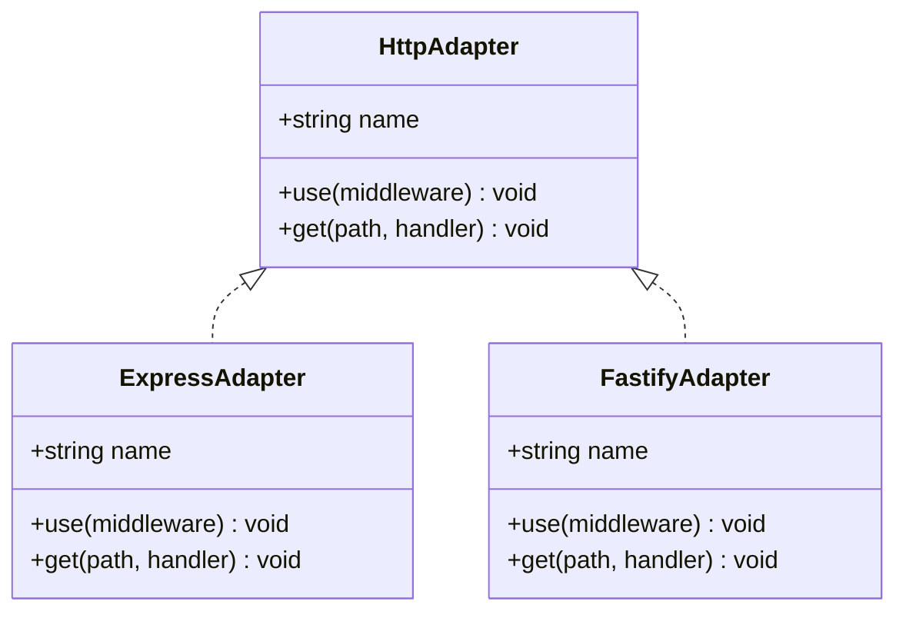

Adapters normalize just enough for plugins to operate:

- request method, URL, path, headers, and request ID access
- response status, headers, body helpers, and finish events
- middleware chaining
- route registration for operational endpoints such as `/metrics`, `/health`, `/readiness`, and `/liveness`

The adapter package also exposes helper types such as `BlacksmithExpressRequest` so application code can access `req.blacksmith` without local type casts scattered through route handlers.

## Plugin Lifecycle

Plugins implement one contract:

```ts
interface BlacksmithPlugin {
  readonly name: string;
  register(runtime: BlacksmithRuntime): void | Promise<void>;
  start?(runtime: BlacksmithRuntime): void | Promise<void>;
  stop?(runtime: BlacksmithRuntime): void | Promise<void>;
}
```

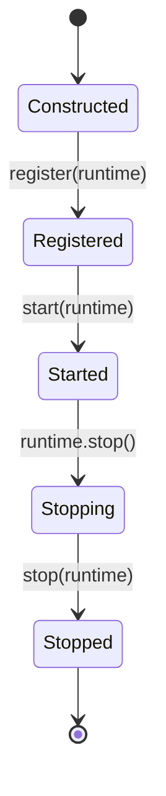

`register` should be deterministic. This is where plugins wire middleware, routes, event subscriptions, registry values, and health checks.

`start` is for side effects that should happen only after all plugins have registered. Signal listeners, background pollers, metrics collectors, and queue workers belong here.

`stop` reverses side effects. Plugins should close network connections, flush buffers, remove listeners, drain queues, and release locks.

## Registry

The registry is a runtime-scoped key-value store. It is not a dependency injection container with lifetime scopes and reflection. It is intentionally plain.

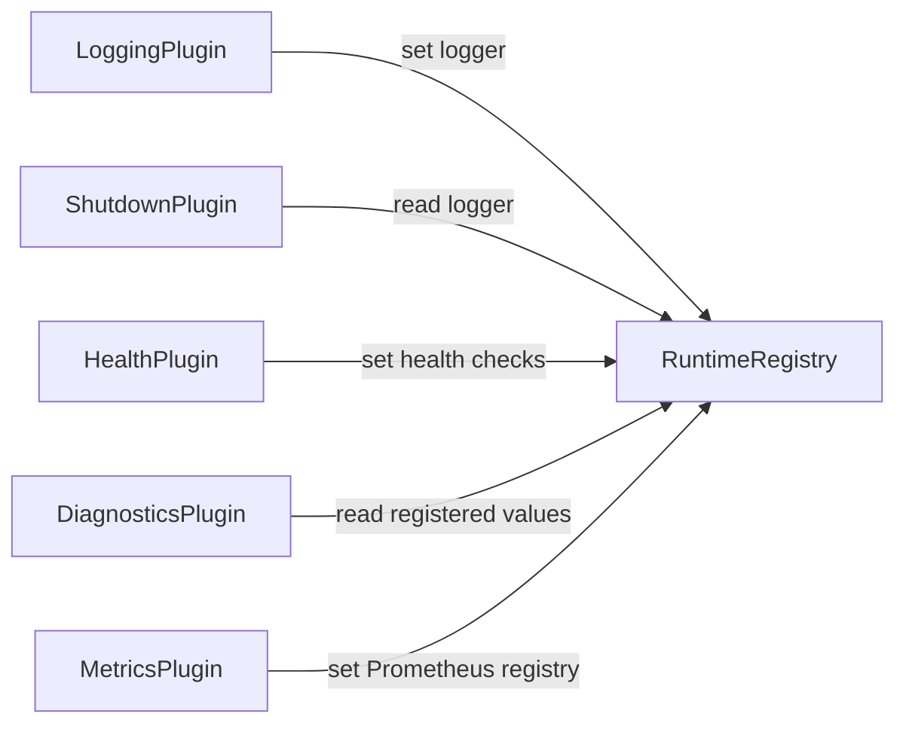

Recommended registry keys should be namespaced:

```ts
runtime.registry.set("logger", logger);
runtime.registry.set("metrics.registry", registry);
runtime.registry.set("health.checks", checks);
runtime.registry.set("shutdown.hooks", hooks);
runtime.registry.set("cache.client", redisClient);
runtime.registry.set("queue.default", queue);
```

Registry values are useful when plugins need to expose operational handles to the app or to diagnostics. They are not a substitute for explicit configuration.

## Event Bus

The event bus is for loose coordination. A plugin can emit domain-level operational events without importing another plugin.

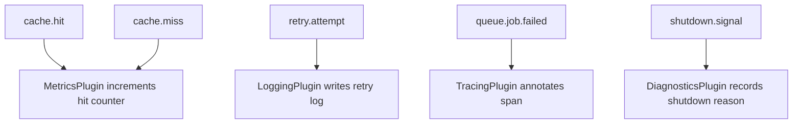

Events should be stable and small. Payloads should be serializable where practical:

```ts
events.emit("cache.hit", {
  key,
  namespace,
  requestId
});
```

The bus is not a message queue. It is in-process coordination for one runtime.

## Observability Stack

Blacksmith treats observability as three connected signals, not three unrelated plugins.

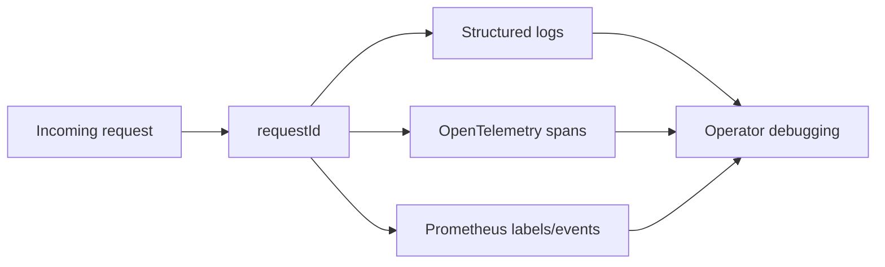

Logging produces structured request records:

```json
{
  "requestId": "abc123",
  "method": "GET",
  "path": "/users/123",
  "statusCode": 200,
  "durationMs": 12.4
}
```

Tracing creates server spans around HTTP requests and records request attributes. As the project grows, database, Redis, queue, and retry spans should attach to the active request trace.

Metrics expose Prometheus-compatible counters, histograms, gauges, and runtime metrics:

```text
blacksmith_http_requests_total
blacksmith_http_request_duration_seconds
blacksmith_service_uptime_seconds
blacksmith_process_resident_memory_bytes
blacksmith_nodejs_eventloop_lag_seconds
```

## Health Model

Health endpoints answer different operational questions:

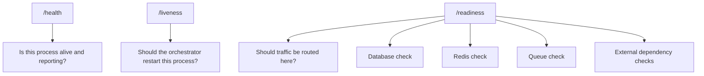

`/health` should be cheap and almost always return `200` while the process is alive.

`/liveness` should answer whether the process is wedged. It should avoid checking dependencies that could restart healthy containers during an upstream outage.

`/readiness` should check dependencies required to serve traffic. It can return `503` when the service is alive but not ready.

## Shutdown Model

Graceful shutdown is coordinated through the runtime. The shutdown plugin listens for process signals and calls registered hooks before stopping the runtime.

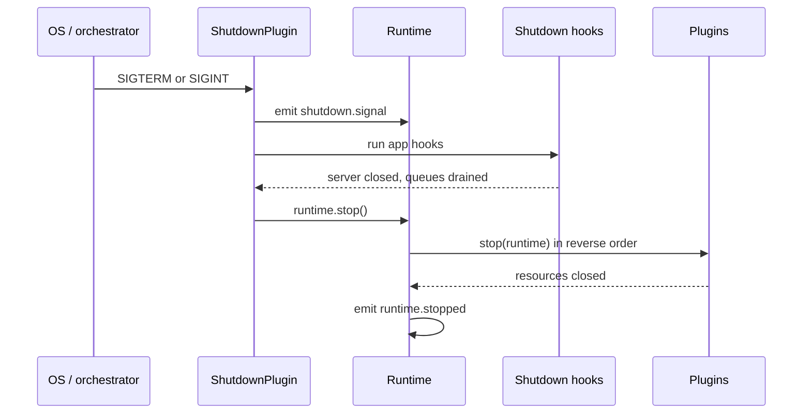

Shutdown hooks should be idempotent. They may run after some requests have already completed, while other resources are still draining.

## Caching Architecture

Caching should be an optional plugin that supports memory and Redis-backed storage. The cache layer should work both as an imperative API and, where TypeScript runtime metadata allows it, through decorators.

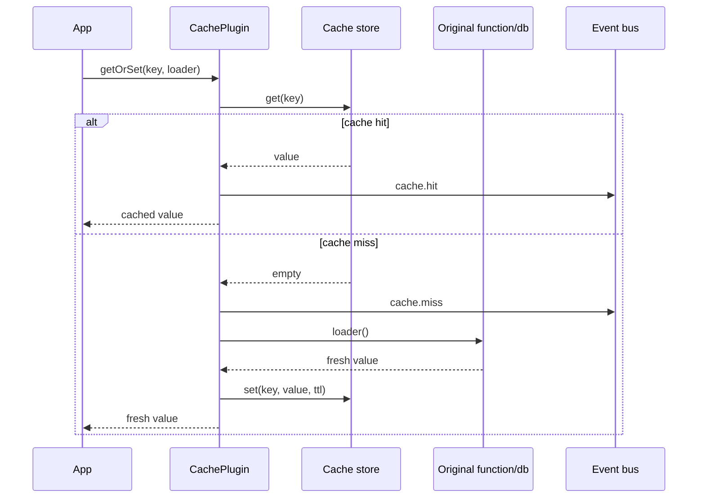

Cache events should feed metrics and diagnostics:

- `cache.hit`
- `cache.miss`
- `cache.set`
- `cache.invalidate`
- `cache.error`

The cache plugin should not assume every value is JSON. Serialization should be configurable per namespace.

## Rate Limiting Architecture

Rate limiting should be enforced through middleware and backed by a pluggable store.

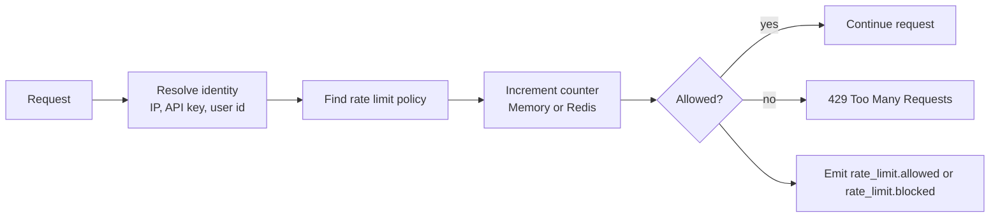

Policies should support:

- route-level limits
- global service limits
- identity extraction
- memory and Redis stores
- standard rate limit headers
- fail-open or fail-closed behavior

## Retry And Circuit Breaker Architecture

Retry policies should wrap outbound work, not inbound HTTP handling by default. Retrying a request handler can duplicate side effects. Retrying a specific dependency call is safer.

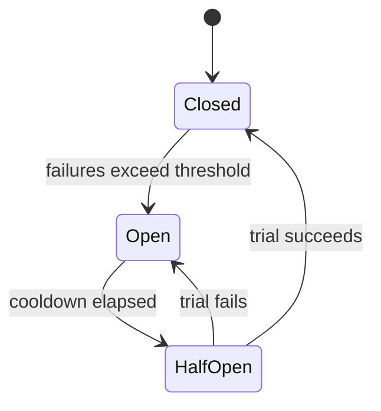

Retry events should include attempt count, delay, error class, and request ID when available. Circuit breaker state should be observable through diagnostics and metrics.

## Queue Architecture

The queue plugin should provide one application-facing API while allowing multiple backends.

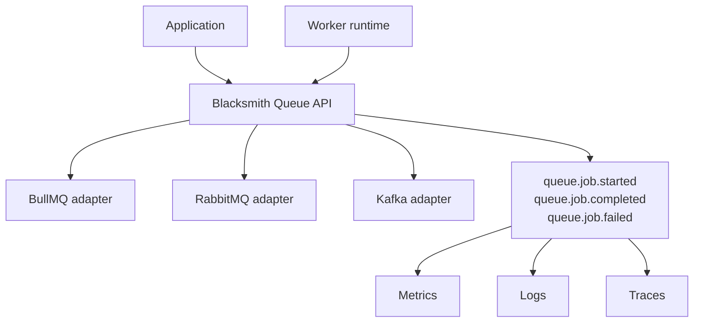

Jobs should carry operational context:

```ts
{
  id: string;
  name: string;
  payload: unknown;
  requestId?: string;
  traceContext?: unknown;
  attempts: number;
}
```

The queue abstraction should avoid pretending all backends are identical. Backend-specific options can exist, but the core job lifecycle should be portable.

## Distributed Locks

Distributed locks protect work that must run once across a fleet: scheduled jobs, payment transitions, cache rebuilds, and resource migrations.

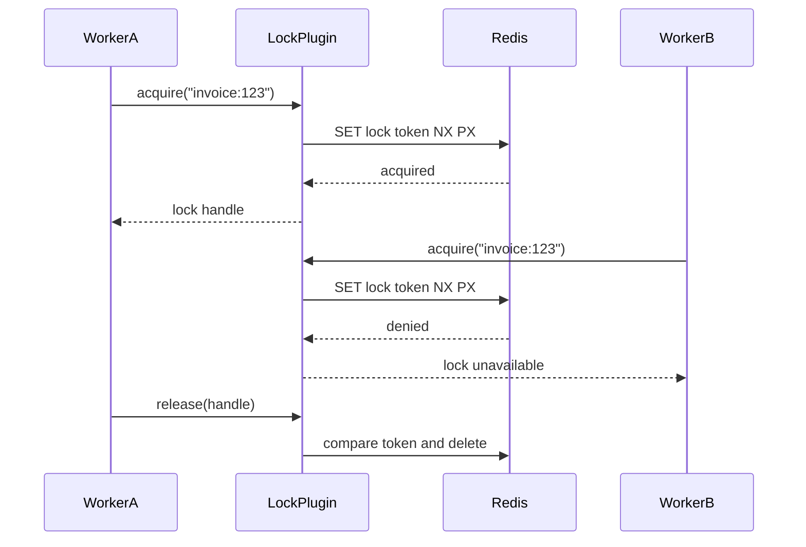

Locks should include ownership tokens, TTLs, renewal, and safe release semantics.

## Diagnostics

Diagnostics should expose runtime state without leaking secrets.

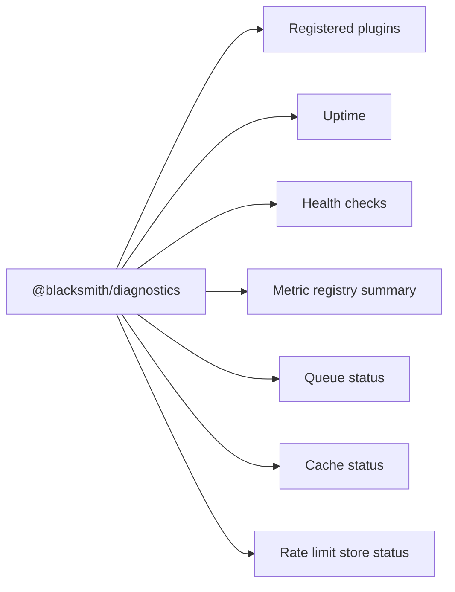

Diagnostics are not a replacement for logs or metrics. They are a quick operator view of what the runtime believes is registered and healthy.

## Configuration

Configuration should be boring. Plugins should accept plain objects, merge them with defaults, and expose the final behavior through predictable runtime state.

```ts
await forge(app, {
  serviceName: "billing-api",
  plugins: [
    new LoggingPlugin(),
    new MetricsPlugin({ endpoint: "/metrics" }),
    new HealthPlugin({ checks }),
    new CachePlugin({ store: redisStore }),
    new RateLimitPlugin({ store: redisStore })
  ]
});
```

The default path should be useful in development and safe in production. Advanced behavior should require explicit configuration.

## Failure Principles

Blacksmith should fail loudly during startup when configuration is invalid. Once the service is running, plugin failures should follow the operational intent of the feature.

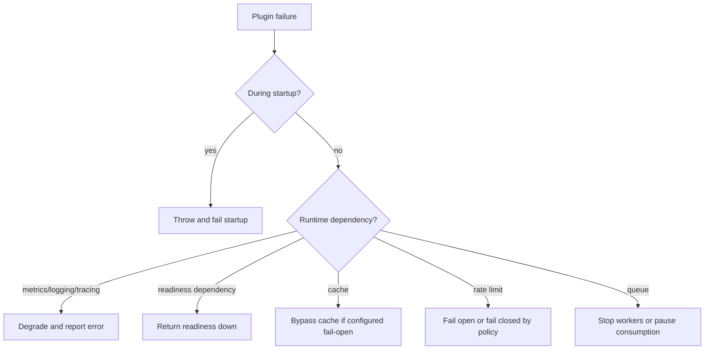

Operational tooling must not make a service less reliable by default. When a plugin can choose between failing open and failing closed, the choice should be explicit.

## Development Rules

- Core stays small.
- Adapters isolate framework behavior.
- Plugins expose operational capability through lifecycle hooks, registry values, and events.
- Cross-plugin behavior uses the event bus, not direct imports.
- Request context is created once and reused everywhere.
- Shutdown paths are tested.
- Metrics, logs, and traces share the same request ID.
- Defaults should be good enough to run, but never surprising in production.
